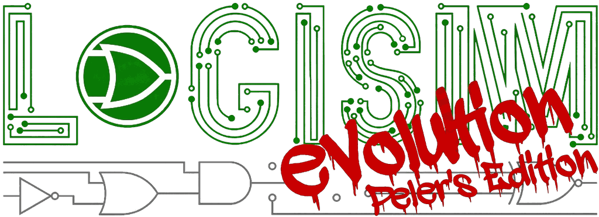
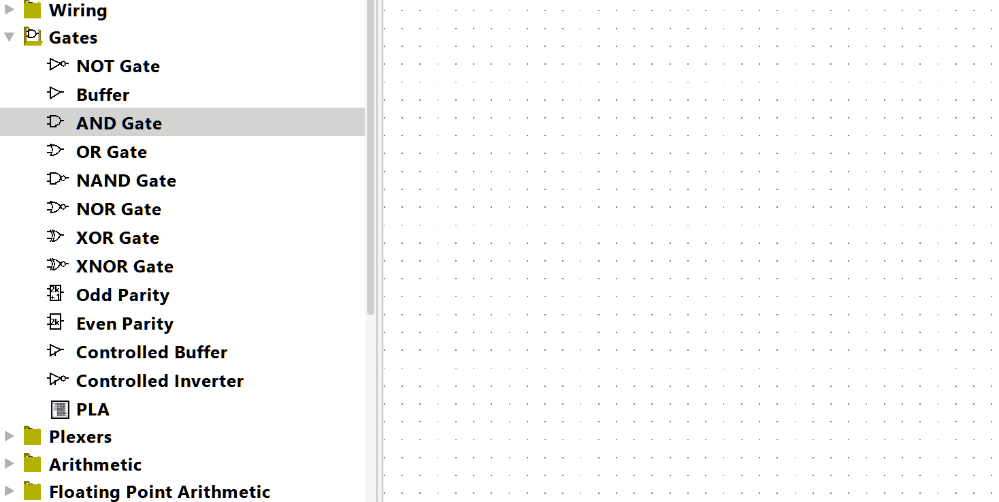
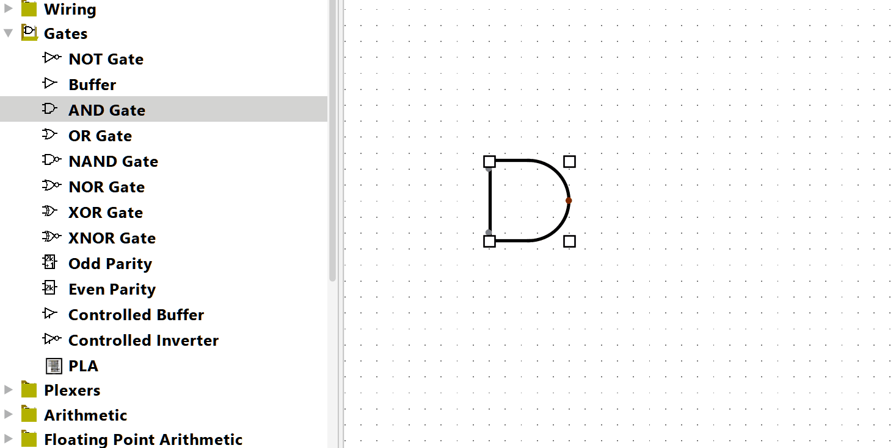
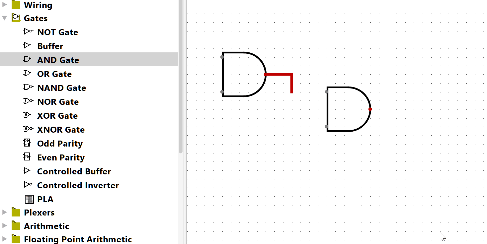
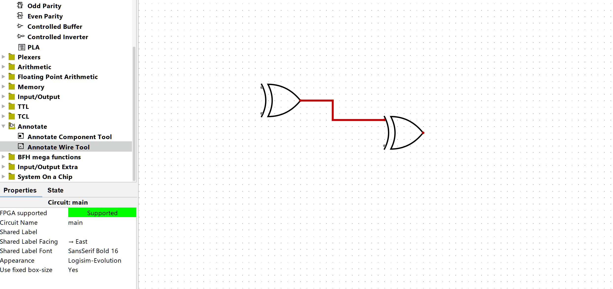
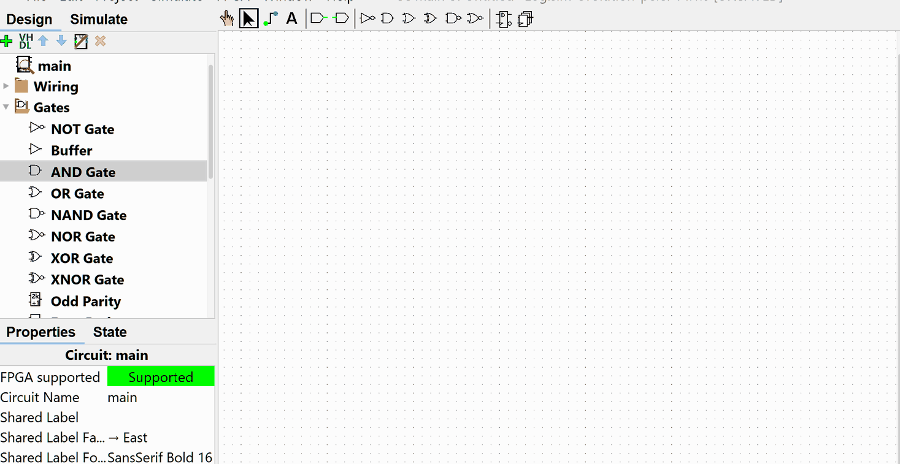
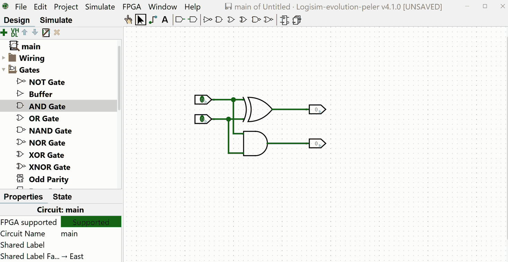

---

# Logisim-evolution — Peler's Edition #

> ## This is an unofficial personal fork. ##
>
> **Essentially all of this software is the work of the
> [Logisim-evolution](https://github.com/logisim-evolution/logisim-evolution) developers and its
> contributors**, built on decades of effort by many people. This fork adds a handful of small
> workflow conveniences for one person's coursework, and nothing more.
>
> It is **not affiliated with, endorsed by, or supported by** the Logisim-evolution project.
>
> **If you are looking for Logisim-evolution, go to
> [the official project](https://github.com/logisim-evolution/logisim-evolution) — not here.**
> It is better maintained, better tested, properly released, and it is the software you actually
> want. Please give the upstream project your stars, your bug reports, and your credit.

---

* **Table of contents**
  * [What this fork changes](#what-this-fork-changes)
  * [Relationship to the upstream project](#relationship-to-the-upstream-project)
  * [Downloads](#downloads)
  * [Requirements](#requirements)
  * [Reporting problems](#reporting-problems)
  * [License and credits](#license-and-credits)

---

## What this fork changes ##

Based on the official Logisim-evolution **v4.1.0** release. Everything else behaves as upstream
does; the additions below are the entire difference.

**Continuous placement**
Double-click a component — in the toolbox or the toolbar — to keep placing it instead of re-picking
it each time. <kbd>Esc</kbd>, <kbd>Enter</kbd> or a right-click stops.

**Quick Rotate**
Right-click a component to rotate it 90° clockwise. The original right-click menu moved to
<kbd>Ctrl</kbd>+left-click.

**Wire auto-snap**
While drawing a wire, endpoints snap to a nearby component pin, with a green ring marking the pin it
will attach to. How near counts, and whether it happens at all, is under **Preferences → Peler's
Features**.

**Schematic annotations**
A new **Annotate** category for attaching free-text notes to a component, or to a wire endpoint
where it meets a component. Notes take multiple lines and follow whatever they are attached to when
it is moved, rotated, or deleted. Double-click an annotate tool to keep annotating.

**Component finder**
<kbd>Ctrl</kbd>+<kbd>F</kbd> opens a floating search box. Type part of a name — in the interface
language or in English, so `and` finds 与门 in a Chinese interface — and pick from the matches,
shown with their real component icons. <kbd>Enter</kbd> selects it and keeps placing it,
<kbd>Shift</kbd>+<kbd>Enter</kbd> places just one — which way round is a setting. It closes on
<kbd>Esc</kbd> or as soon as it loses focus. The shortcut is listed under **Preferences → Hotkeys**
and can be rebound.

**Its own file format**
This fork saves `.pcirc`, and `.circ` is left to official Logisim-evolution. A `.pcirc` file keeps
everything; **Save As** also offers `.circ` for handing work to someone running the official
release, which writes what upstream can read — annotations become plain text labels there, and the
note's link to its component is not preserved. Opening works either way round: this fork reads an
official `.circ` exactly as upstream does.

The reason for two formats is that annotations are this fork's own idea. Official Logisim-evolution
rebuilds a file from its own model when it saves, so anything it cannot represent is gone the first
time it saves — silently. A separate extension means that can only happen to a copy you exported on
purpose, never to the file you work in.

The application is packaged as `logisim-evolution-peler`, its icon carries a red **P**, and its
installer registers `.pcirc` and its own MIME type — so it sits alongside an official
Logisim-evolution install rather than taking over its files. The two also keep their **settings**
apart: language, window layout, recent files, keyboard shortcuts and the rest live in this
edition's own store, not the one upstream uses. On first launch it offers to copy the existing
settings across, and **File → Import Settings from Logisim-evolution…** does the same later. The
FPGA workspace is separate for the same reason — each edition regenerates and clears its own
project directories, so this one defaults to `~/logisim_evolution_peler_workspace`; **FPGA →
Options** still points it anywhere you like.

**Interactive HTML export (experimental)**
**File → Export as interactive HTML…** writes the current circuit as a single HTML file that still
simulates. Open it in any browser, with no plugin and nothing to install: click an input pin to
change it, press a button, flip a DIP switch, and values propagate through the circuit exactly as
they do here. Clock circuits get tick, run and reset controls. Nothing can be moved, rewired or
edited, which is the point — it is a circuit to hand to someone, not a copy of the editor.

The page is a workspace rather than a document: the same white sheet and dot grid as the canvas
here, filling the window, with one small control strip floating in the corner and nothing else. Drag to pan, <kbd>Ctrl</kbd>+scroll
to zoom about the pointer, scroll to move up and down and <kbd>Shift</kbd>+scroll to move sideways,
which is what the canvas in this application does with the same gestures. Pinch works on a
trackpad or a touchscreen. It opens with the circuit fitted, and a zoom control sits in the corner
the editor's own does.

The picture is Logisim's own. Every component is drawn by the same paint code the editor uses, so
gates, displays and buses look the same in the page as on screen, down to the colours you have set.
Subcircuits are flattened into the page, so a design built out of your own blocks exports as one
working whole.

Two limits worth knowing. The page models propagation as a settling process rather than with per
component delays, so a circuit that depends on gate delay — a pulse made from a chain of inverters,
say — will not behave as it does here. And the export refuses, naming what it found, rather than
writing a page for a circuit containing a component it cannot simulate: RAM, ROM, shift registers
and the divider are not supported yet.

**AI clients over MCP (experimental)**
An embedded [Model Context Protocol](https://modelcontextprotocol.io) server lets an AI client —
Claude, Codex — drive the running application: create circuits, place components, draw wires, run
the simulator, export. Every change goes through the same undo stack your own edits do, so it is
one project being worked on rather than a file being rewritten behind your back.

**Off unless you turn it on**, under **Preferences → Peler's Features**. When you do, it listens on
the loopback interface only and requires a token that is generated for you. Nothing on the machine
can reach it without that token, and file access stays inside the open project's directory unless
you name other locations with `-Dlogisim.mcp.allowedPaths`.

The **MCP** menu, next to Help, holds the two ways to connect a client. While the server is off it
still opens, and says what MCP is and what turning it on would allow, with a button that takes you
to the setting:

* **Copy MCP Configuration** puts the whole client configuration, token included, on the clipboard,
  for a client that takes an HTTP endpoint (Claude Code, Codex, VS Code).
* **Export MCP Bundle** writes a `.mcpb` file. Claude Desktop installs one by double-click, and
  takes no HTTP endpoint at all — so the bundle carries a small bridge script that relays its
  standard input to this window. It needs Node.js available to the client, and it is written for
  the port and token in force when you export it: export a fresh one if either changes.

**Its own settings page**
**Preferences → Peler's Features** holds the settings for everything above, in one place rather
than scattered through upstream's panels — so what this fork lets you change is also the list of
what it changed:

* **Picking a component** — click to place one and double-click to keep placing (the default),
  click to keep placing straight away, or never let a double-click start continuous placement.
* **The component finder** — whether <kbd>Enter</kbd> keeps placing or places one.
  <kbd>Shift</kbd>+<kbd>Enter</kbd> always does the other.
* **Wire auto-snap** — on or off, and how near a pin an endpoint has to come. The distance is in
  circuit units, so ten is one grid square at every zoom level.
* **Right-click** — rotate clockwise (the default), rotate anticlockwise, or open the component
  menu as official Logisim-evolution does. That last one puts the right mouse button back exactly
  where someone coming from the official release expects it.
* **New annotations** — the font, size and colour a new note starts with. Existing notes keep
  theirs; each one saves its own.
* **Saving as `.circ`** — how often you are warned that the compatible format drops annotations:
  every time, once per file each session (the default), or never.
* **AI clients (MCP server)** — whether it runs at all (off by default), and which port.

The in-application **Help → About** window is left exactly as upstream ships it, crediting
upstream; this fork's own changes are described under **Help → About Peler's Edition**.

---

## Relationship to the upstream project ##

* This fork tracks official Logisim-evolution **releases**, not upstream's development branch, so
  it does not ship unreleased upstream work.
* No upstream functionality is removed or altered beyond the additions listed above.
* Upstream's copyright notices, credits, and attribution are left intact.
* Bug reports for **this build** belong in
  [this fork's issue tracker](https://github.com/PelerYuan/logisim-evolution-peler/issues).
  **Never report them to the upstream project** — they did not build this and cannot support it.
  If you can reproduce a problem in the official Logisim-evolution release, report it upstream instead,
  where it will actually get fixed for everyone.

---

## Downloads ##

Installable packages are on the
[releases page](https://github.com/PelerYuan/logisim-evolution-peler/releases). Each bundles its
own Java runtime, so Java does not need to be installed separately:

* `logisim-evolution-peler-<version>-amd64.msi` — Windows installer (Intel/AMD)
* `logisim-evolution-peler-<version>-windows-amd64.zip` — Windows, no installer
* `logisim-evolution-peler-<version>-x86_64.dmg` — macOS (Intel)
* `logisim-evolution-peler-<version>-aarch64.dmg` — macOS (Apple silicon)
* `logisim-evolution-peler_<version>_amd64.deb` — Debian/Ubuntu (x86-64)
* `logisim-evolution-peler_<version>_arm64.deb` — Debian/Ubuntu (ARM64)
* `logisim-evolution-peler-<version>-1.x86_64.rpm` — Fedora/RHEL/SUSE (x86-64)
* `logisim-evolution-peler-<version>-1.aarch64.rpm` — Fedora/RHEL/SUSE (ARM64)

Releases marked *pre-release* are development builds kept only for history; use the latest normal
release.

**Note for macOS users**: these packages are not signed with an Apple certificate. On first launch,
right-click (or <kbd>Ctrl</kbd>+click) the application icon in Finder and choose **Open**, then
confirm. See [Safely open apps on your Mac](https://support.apple.com/en-us/HT202491).

---

## Requirements ##

A Java application, so it runs anywhere with a Java runtime. The packages above bundle
[Java 21](https://adoptium.net/temurin/releases/); building from source requires it.

---

## Reporting problems ##

Please check first whether the problem also happens in the
[official Logisim-evolution release](https://github.com/logisim-evolution/logisim-evolution/releases).

* **Happens in the official release too** → report it
  [upstream](https://github.com/logisim-evolution/logisim-evolution/issues), so the fix reaches
  everyone.
* **Only happens here** → it is this fork's fault; report it in
  [this fork's issue tracker](https://github.com/PelerYuan/logisim-evolution-peler/issues).

---

## License and credits ##

* `Logisim-evolution` is copyrighted ©2001-2024 by the Logisim-evolution
  [developers](docs/credits.md). The overwhelming majority of this codebase is their work.
* This fork is released under the same license: the
  [GNU General Public License v3](https://www.gnu.org/licenses/gpl-3.0.en.html).
* Original Logisim was created by Carl Burch; Logisim-evolution is the continuation of that work by
  its developers and contributors. Full credits: [docs/credits.md](docs/credits.md) and the
  application's **Help → About** window.
