[](https://github.com/PelerYuan/logisim-evolution-peler)

---

# Logisim-evolution — Peler's Edition #

[](https://github.com/PelerYuan/logisim-evolution-peler/releases/latest)
[](https://github.com/PelerYuan/logisim-evolution-peler/actions/workflows/build.yml)
[](https://github.com/logisim-evolution/logisim-evolution/releases/tag/v4.1.0)
[](https://www.gnu.org/licenses/gpl-3.0.en.html)
[](https://adoptium.net/temurin/releases/)

A personal fork of the digital logic designer and simulator
[Logisim-evolution](https://github.com/logisim-evolution/logisim-evolution), carrying a handful of
workflow conveniences for one person's coursework. Everything else behaves as the official release
does.

> ## This is an unofficial personal fork. ##
>
> **Essentially all of this software is the work of the
> [Logisim-evolution](https://github.com/logisim-evolution/logisim-evolution) developers and its
> contributors**, built on decades of effort by many people. This fork adds a handful of small
> workflow conveniences, and nothing more.
>
> It is **not affiliated with, endorsed by, or supported by** the Logisim-evolution project.
>
> **If you are looking for Logisim-evolution, go to
> [the official project](https://github.com/logisim-evolution/logisim-evolution) — not here.**
> It is better maintained, better tested, properly released, and it is the software you actually
> want. Please give the upstream project your stars, your bug reports, and your credit.

---

* **Table of contents**
  * [Install](#install)
  * [What this fork adds](#what-this-fork-adds)
    * [Drawing a circuit faster](#drawing-a-circuit-faster)
    * [Making a circuit readable](#making-a-circuit-readable)
    * [Handing a circuit to someone else](#handing-a-circuit-to-someone-else)
    * [One page for all of it](#one-page-for-all-of-it)
    * [AI clients over MCP](#ai-clients-over-mcp-experimental)
  * [Relationship to the upstream project](#relationship-to-the-upstream-project)
  * [Reporting problems](#reporting-problems)
  * [Building from source](#building-from-source)
  * [License and credits](#license-and-credits)

---

## Install ##

Installable packages are on the
[releases page](https://github.com/PelerYuan/logisim-evolution-peler/releases/latest). Each bundles
its own [Java 21](https://adoptium.net/temurin/releases/) runtime, so Java does not need to be
installed separately.

| Platform | File |
| --- | --- |
| Windows (installer) | `logisim-evolution-peler-<version>-amd64.msi` |
| Windows (portable) | `logisim-evolution-peler-<version>-windows-amd64.zip` |
| macOS (Apple silicon) | `logisim-evolution-peler-<version>-aarch64.dmg` |
| macOS (Intel) | `logisim-evolution-peler-<version>-x86_64.dmg` |
| Debian/Ubuntu | `logisim-evolution-peler_<version>_amd64.deb` · `_arm64.deb` |
| Fedora/RHEL/SUSE | `logisim-evolution-peler-<version>-1.x86_64.rpm` · `-1.aarch64.rpm` |

Releases marked *pre-release* are rolling development builds kept only for testing; use the latest
normal release. Each release's own notes are on its
[release page](https://github.com/PelerYuan/logisim-evolution-peler/releases); a condensed history
of what this fork added, version by version, is in
[`docs/peler-edition/CHANGELOG.md`](docs/peler-edition/CHANGELOG.md).

**macOS**: these packages are not signed with an Apple certificate. On first launch, right-click
(or <kbd>Ctrl</kbd>+click) the application icon in Finder and choose **Open**, then confirm. See
[Safely open apps on your Mac](https://support.apple.com/en-us/HT202491).

**Installing alongside the official release** is the intended arrangement. This edition is packaged
as `logisim-evolution-peler`, its icon carries a red **P**, it saves `.pcirc` rather than `.circ`,
and its settings, file associations and FPGA workspace are its own — so it sits beside an official
install rather than taking it over. On first launch it offers to copy your existing
Logisim-evolution settings across.

---

## What this fork adds ##

Based on the official Logisim-evolution **v4.1.0** release. No upstream functionality is removed or
altered; the list below is the entire difference.

| | |
| --- | --- |
| **Drawing** | continuous placement · right-click to rotate · wire auto-snap · <kbd>Ctrl</kbd>+<kbd>F</kbd> component finder |
| **Reading** | 74xx chips as logic symbols · switch every chip's drawing at once · schematic annotations |
| **Building** | save a circuit as your own component · a catalog that outlives the project |
| **Sharing** | its own `.pcirc` format · interactive HTML export |
| **Other** | one settings page for all of it · an MCP server for AI clients, off by default |

### Drawing a circuit faster ###

**Continuous placement.** Double-click a component — in the toolbox or the toolbar — to keep placing
it instead of re-picking it each time. <kbd>Esc</kbd>, <kbd>Enter</kbd> or a right-click stops.

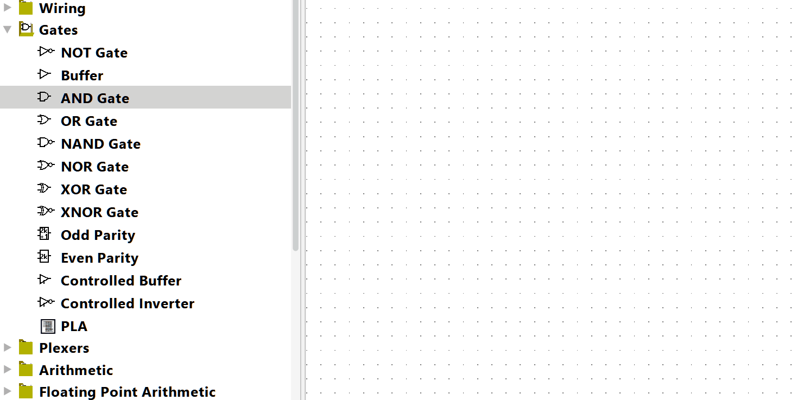

**Quick Rotate.** Right-click a component to rotate it 90° clockwise. The original right-click menu
moves to <kbd>Ctrl</kbd>+left-click.

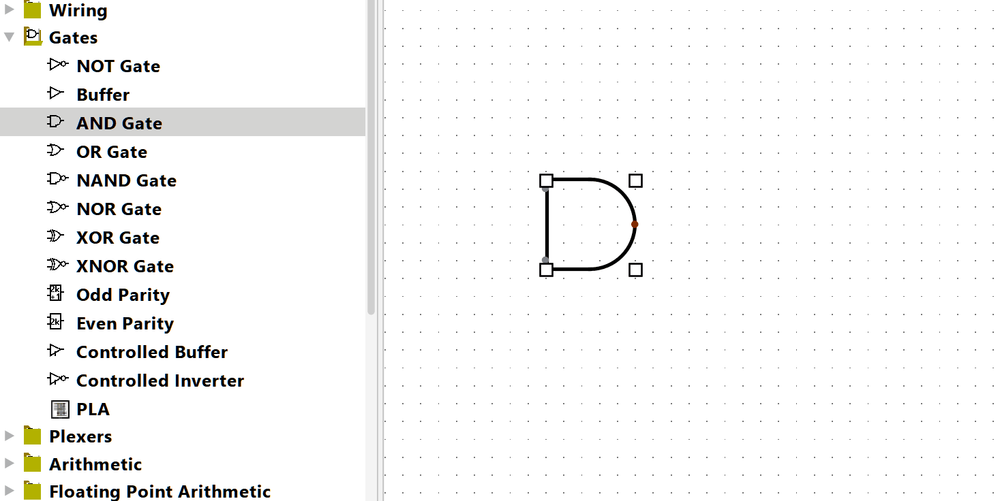

**Wire auto-snap.** While drawing a wire, endpoints snap to a nearby component pin, with a green
ring marking the pin they will attach to.

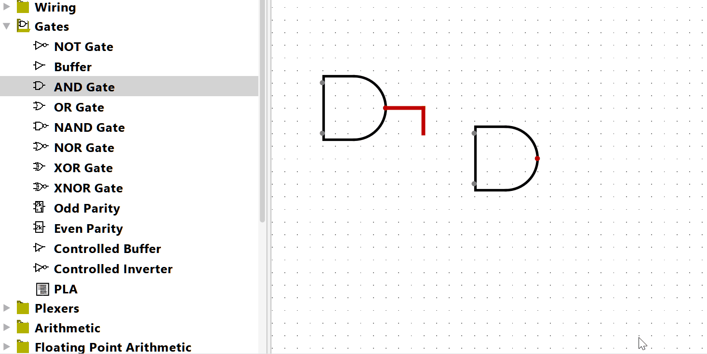

**Component finder.** <kbd>Ctrl</kbd>+<kbd>F</kbd> opens a floating search box. Type part of a name,
in the interface language or in English — so `and` finds 与门 in a Chinese interface — and pick from
the matches, shown with their real component icons. <kbd>Enter</kbd> places and keeps placing,
<kbd>Shift</kbd>+<kbd>Enter</kbd> places one; which way round is a setting.

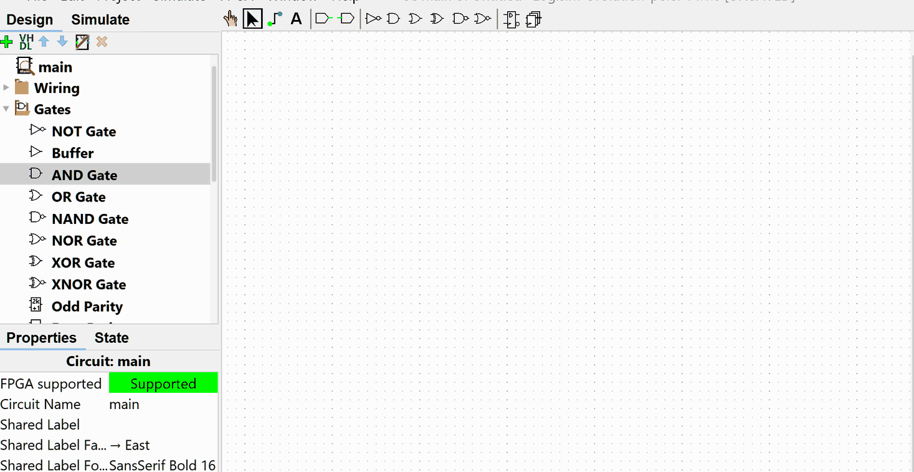

### Making a circuit readable ###

**Components as logic symbols.** A **TTL Symbols** category holding the same sixty-one 74xx chips
upstream ships, drawn the way a datasheet's logic diagram draws them — a rectangle with the inputs
down the left and the outputs down the right, grouped by function, active-low pins carrying an
inversion circle — rather than as a numbered DIP package with its pins in pin order.

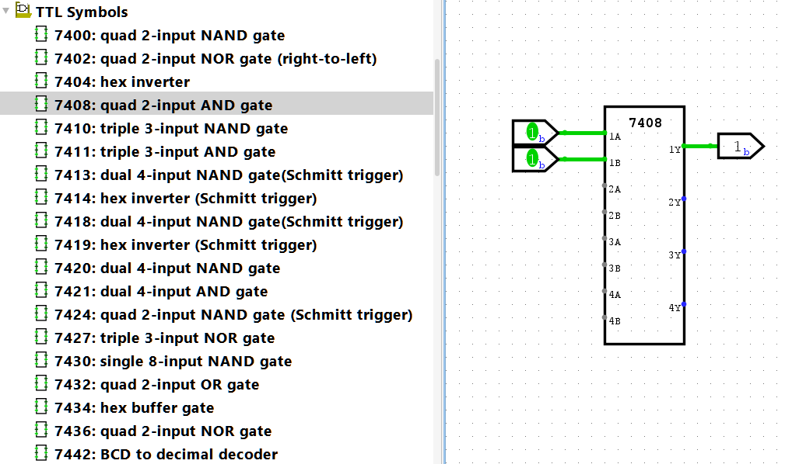

Both drawings are in the toolbox and the DIP chips are untouched. A symbol simulates through the
same code the chip it redraws does, with the same pins in the same order, so the two are one chip in
two pictures rather than two models to keep in step. A **BFH Symbols** category does the same for
the two `BFH-Praktika` converters, which upstream draws in the shape of the seven-segment display
they drive rather than in the shape of what they compute.

**Switching every chip at once.** The 74xx DIP chips can show the gates inside the package instead
of the numbered pins. **Preferences → Peler's Features** sets which drawing a newly placed chip
starts with; **Project → TTL Chip Drawing** changes the ones already placed, covering the whole
project including subcircuits in a single step you can undo. Nothing moves when the drawing changes,
so it is safe on a fully wired sheet.

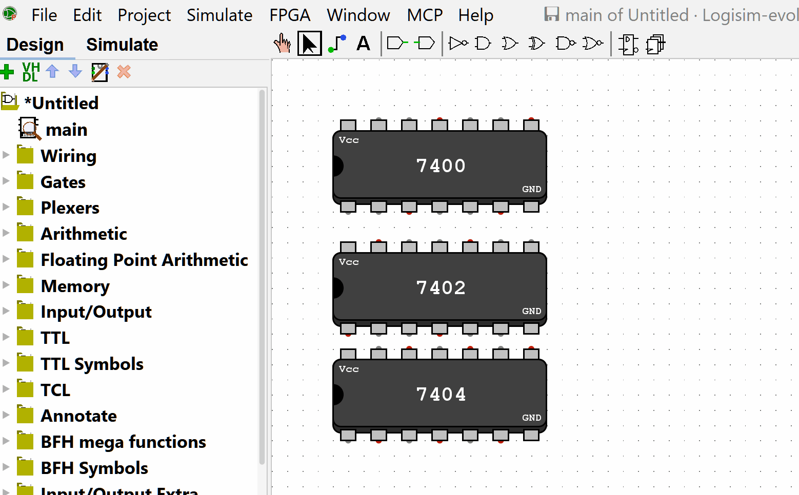

**Schematic annotations.** An **Annotate** category for attaching free-text notes to a component, or
to a wire endpoint where it meets a component. Notes take multiple lines and follow whatever they
are attached to when it is moved, rotated or deleted.

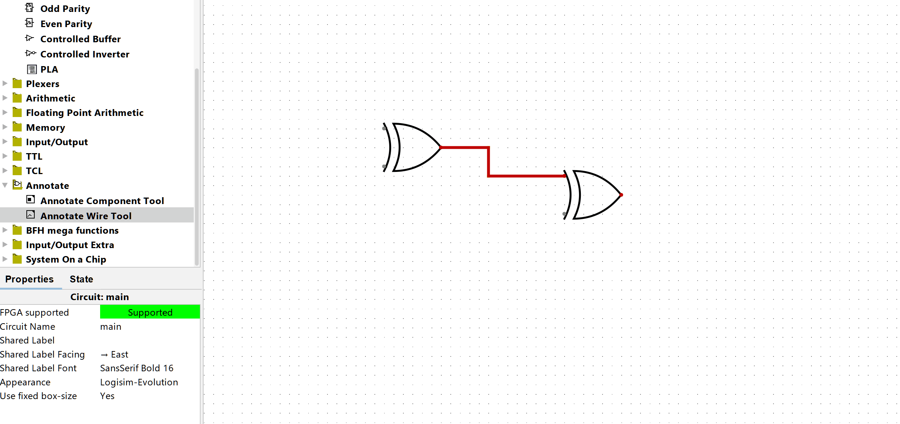

### Making your own components ###

**Save a circuit as a component.** Draw a circuit the way you always would, then **Project → Save as
Custom Component…**. A window shows the box it will become, laid out for you to start from, and you
can rearrange all of it: drag a port anywhere on the box, drag the right or bottom edge to resize
it, drag the name to move it, and double-click a port to rename it. **Arrange for Me** puts the
whole thing back to a tidy default whenever you have made a mess of it. Name every port -- an
unnamed one stops the save, because a nameless port on someone else's symbol is a pin you have to
open the circuit to identify.

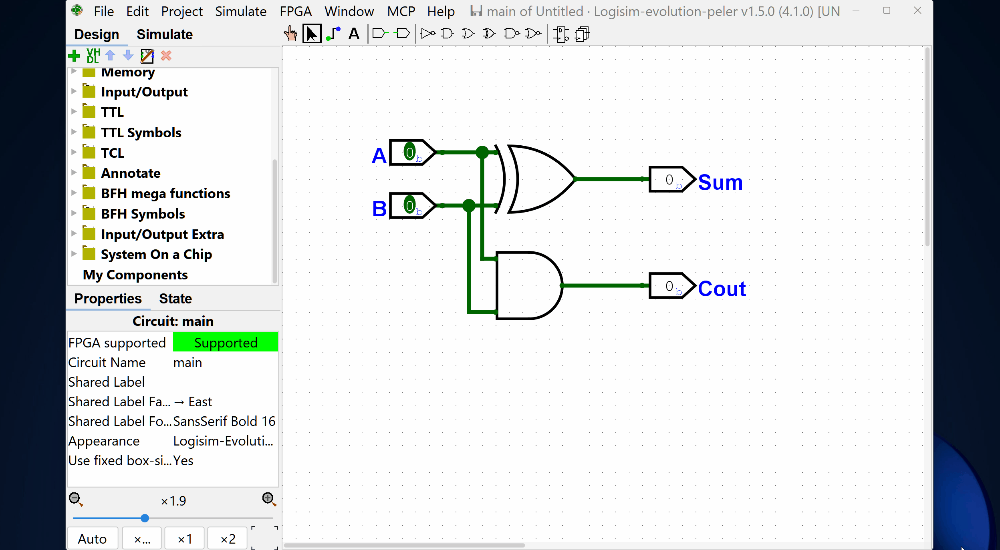

Name the component whatever reads best -- **Half Adder** is a fine name, spaces included. Letters,
digits, spaces and underscores are all allowed, starting with a letter; the file on disk turns the
spaces into underscores so that the circuit inside it is a name Logisim can carry, and everywhere
you actually read the name it stays the one you typed.

The component then appears under **My Components** in the toolbox of every project on this machine,
not just the one it was drawn in, and it is still there after a restart. It is a real component:
rotate it, label it, wire it, drop it inside another component.

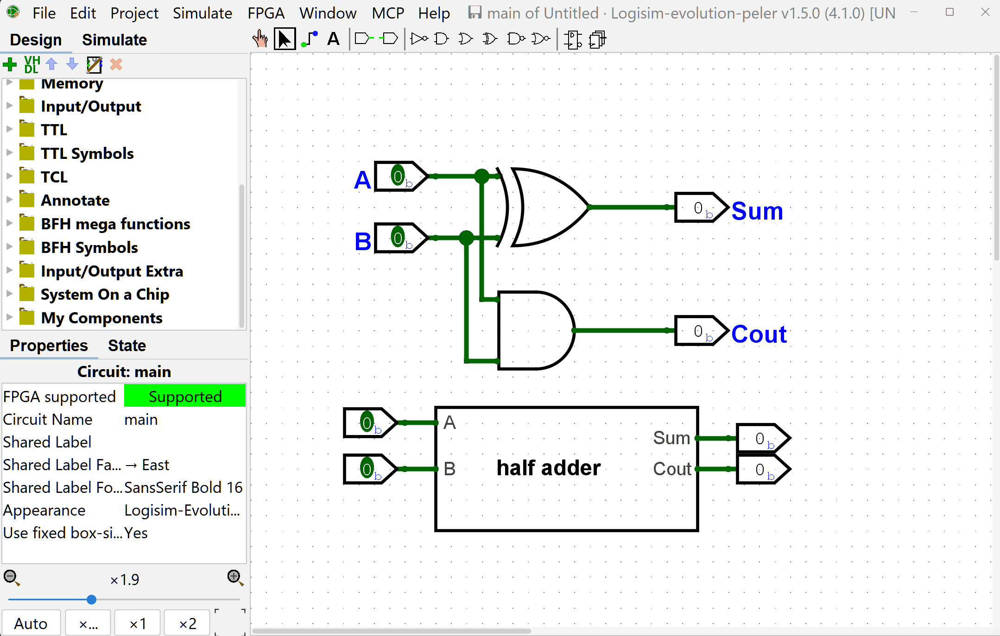

**Layouts are fixed once published, versions are not.** A published component's ports do not move
under the projects using it. To move them, publish again -- the save window notices and offers a new
version instead of an overwrite, telling you exactly what changed. Both versions stay installed, so
nothing you already wired moves on its own. Making the box roomier or nudging the name is not a
change of that kind and replaces the component where it stands: ports are pinned to the box's
top-left corner, so a bigger box leaves every one of them exactly where your wires already meet it. **Project → Custom Components…**
lists what is installed, imports a component someone sent you, opens one for editing, deletes one --
refusing while the project still has it placed -- and swaps every instance of one version for
another, showing the port differences first when there are any.


**Saving to `.circ` keeps them.** A project that uses custom components saves to official
Logisim-evolution's format with each component written in as an ordinary circuit carrying the same
drawing, so the ports land on the same coordinates and no wire moves. What is lost over there is
only the link to your catalog.

### Handing a circuit to someone else ###

**Its own file format.** This fork saves `.pcirc` and leaves `.circ` to official Logisim-evolution.
A `.pcirc` file keeps everything; **Save As** also offers `.circ` for handing work to someone running
the official release, and tells you what that costs before writing — annotations become plain text
labels and lose their link to a component, and logic symbols are left out altogether, since upstream
has no such component to put them in. Opening works either way round: this fork reads an official
`.circ` exactly as upstream does.

The reason for two formats: official Logisim-evolution rebuilds a file from its own model when it
saves, so anything it cannot represent is gone the first time it saves, silently. A separate
extension means that can only happen to a copy you exported on purpose, never to the file you work
in.

**Interactive HTML export.** **File → Export as interactive HTML…** writes the current circuit as a
single HTML file that still simulates. Open it in any browser, with no plugin and nothing to
install: click an input pin, press a button, flip a DIP switch, and values propagate exactly as they
do here. Clock circuits get tick, run and reset controls. Nothing can be moved, rewired or edited,
which is the point — it is a circuit to hand to someone, not a copy of the editor.

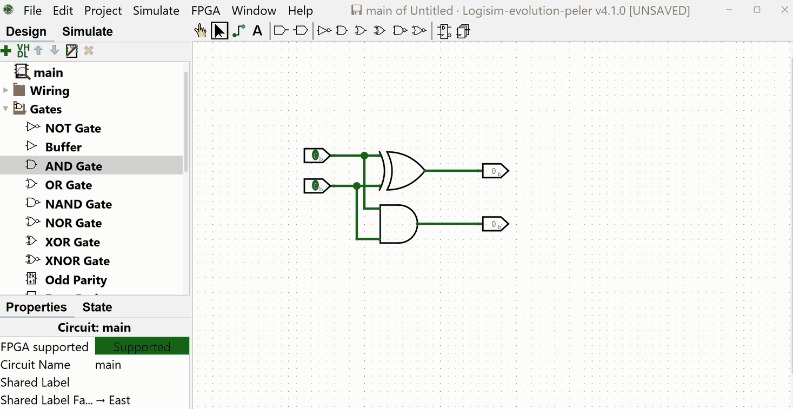

Every component is drawn by the same paint code the editor uses, so the page looks like the canvas
does, down to the colours you have set, and subcircuits are flattened so a design built from your
own blocks exports as one working whole. Two limits: the page models propagation as a settling
process rather than with per-component delays, so a circuit that depends on gate delay will not
behave as it does here; and rather than write a broken page, the export refuses — naming what it
found — for a circuit holding a component it cannot simulate, which includes RAM, ROM, shift
registers, the divider and the 74xx chips in either drawing.

### One page for all of it ###

**Preferences → Peler's Features** collects the settings for everything above in one place, rather
than scattering them through upstream's panels — so what this fork lets you change is also the list
of what it changed. In every case, one of the choices is *behave the way official Logisim-evolution
does*.

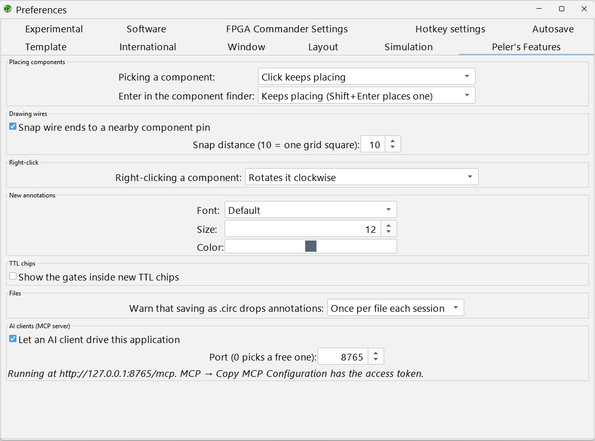

The in-application **Help → About** window is left exactly as upstream ships it, crediting upstream;
this fork's own changes are described under **Help → About Peler's Edition**.

### AI clients over MCP (experimental) ###

An embedded [Model Context Protocol](https://modelcontextprotocol.io) server lets an AI client —
Claude, Codex — drive the running application: create circuits, place components, draw wires, run the
simulator, export. Every change goes through the same undo stack your own edits do, so it is one
project being worked on rather than a file being rewritten behind your back.

**It is off unless you turn it on.** When you do, it listens on the loopback interface only and
requires a token generated for you; file access stays inside the open project's directory unless you
name other locations with `-Dlogisim.mcp.allowedPaths`.

The **MCP** menu holds the two ways to connect a client: **Copy MCP Configuration** for a client that
takes an HTTP endpoint (Claude Code, Codex, VS Code), and **Export MCP Bundle** for Claude Desktop,
which installs a `.mcpb` by double-click and needs Node.js available to relay its standard input to
this window. A bundle is written for the port and token in force when you export it — export a fresh
one if either changes.

Treat this as experimental: it works and it is tested, but the set of operations it offers is still
being redesigned.

---

## Relationship to the upstream project ##

* This fork tracks official Logisim-evolution **releases**, not upstream's development branch, so it
  does not ship unreleased upstream work.
* No upstream functionality is removed or altered beyond the additions above.
* Upstream's copyright notices, credits and attribution are left intact.

---

## Reporting problems ##

Please check first whether the problem also happens in the
[official Logisim-evolution release](https://github.com/logisim-evolution/logisim-evolution/releases).

* **Happens in the official release too** → report it
  [upstream](https://github.com/logisim-evolution/logisim-evolution/issues), so the fix reaches
  everyone.
* **Only happens here** → it is this fork's fault; report it in
  [this fork's issue tracker](https://github.com/PelerYuan/logisim-evolution-peler/issues).

**Never report a problem with this build to the upstream project** — they did not build it and
cannot support it.

---

## Building from source ##

Requires [JDK 21](https://adoptium.net/temurin/releases/). The Gradle wrapper is included:

```bash
./gradlew shadowJar
```

The runnable jar lands in `build/libs/`. `./gradlew check` runs the tests and the style checks;
`./gradlew createAll` builds the packages for the platform you are on. See
[docs/developers.md](docs/developers.md) for the full developer's corner, and
[docs/peler-edition/ROADMAP.md](docs/peler-edition/ROADMAP.md) for the design notes and reasoning
behind each feature above.

---

## License and credits ##

* `Logisim-evolution` is copyrighted ©2001-2024 by the Logisim-evolution
  [developers](docs/credits.md). The overwhelming majority of this codebase is their work.
* This fork is released under the same license: the
  [GNU General Public License v3](https://www.gnu.org/licenses/gpl-3.0.en.html).
* Original Logisim was created by Carl Burch; Logisim-evolution is the continuation of that work by
  its developers and contributors. Full credits: [docs/credits.md](docs/credits.md) and the
  application's **Help → About** window.
